# 3

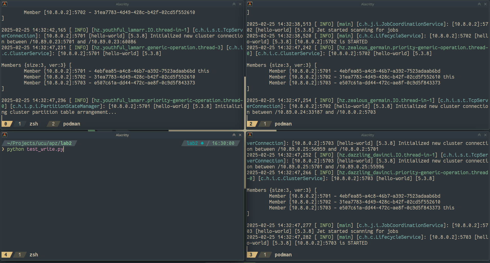

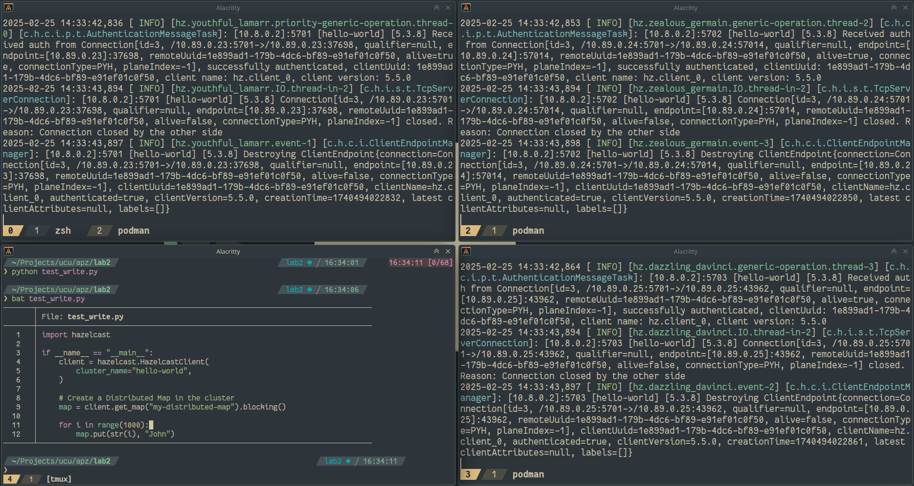

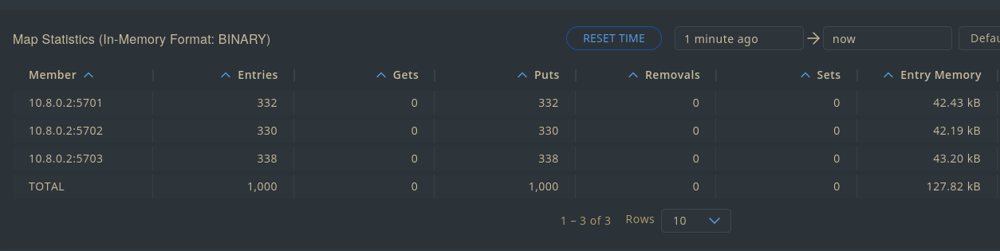

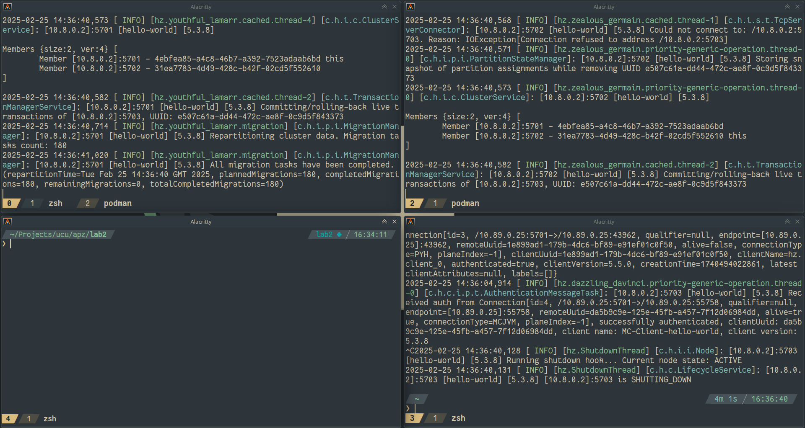

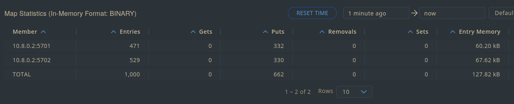

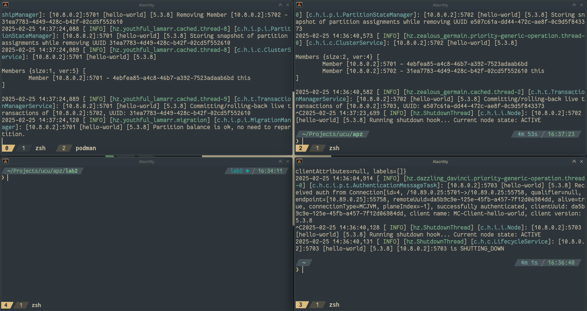

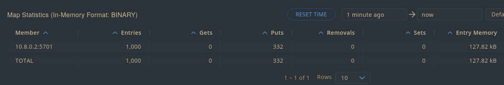

При вимкненні однієї ноди чи кількох послідовно втрат даних немає - лишаються бекапи, які ширяться між нодами

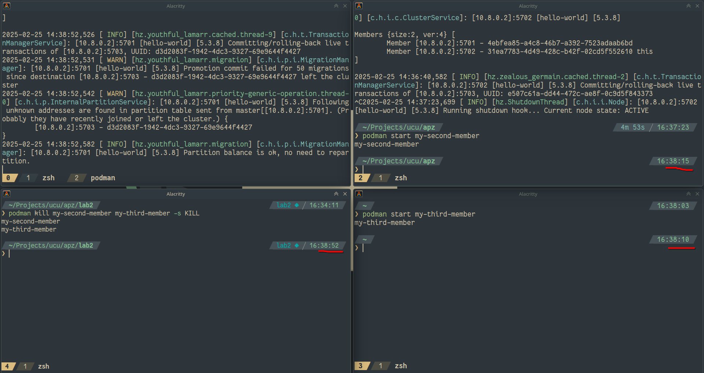

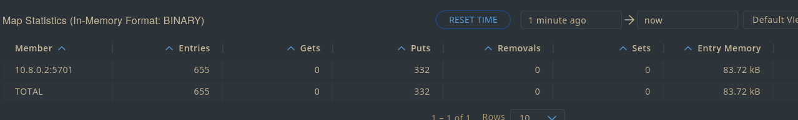

При одночасному вимкненні двох втрачається частина даних - ті, які були збереженні на одній із тих, що вимкнулися, а бекап яких був на іншій з тих, що вимкнулися

# 4

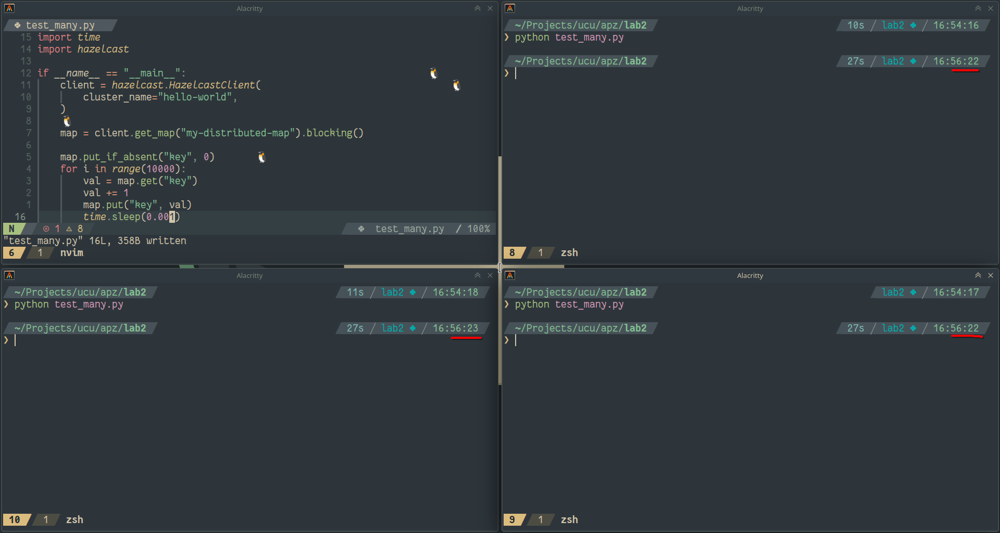

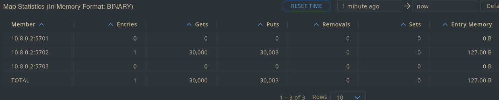

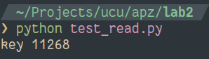

Бачимо data race

# 5

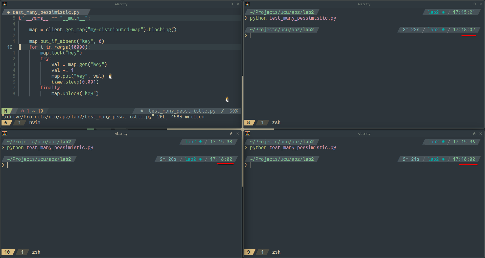

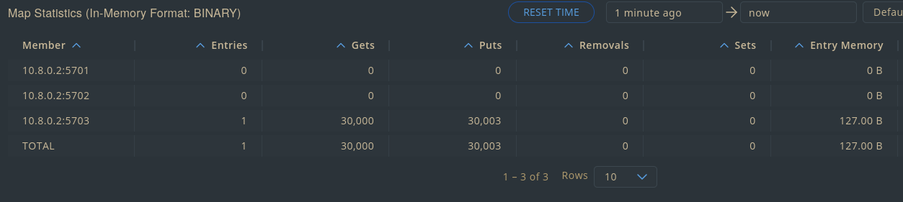

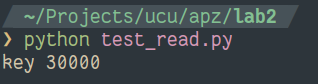

Нема data race, але працює більше двох хвилин

# 6

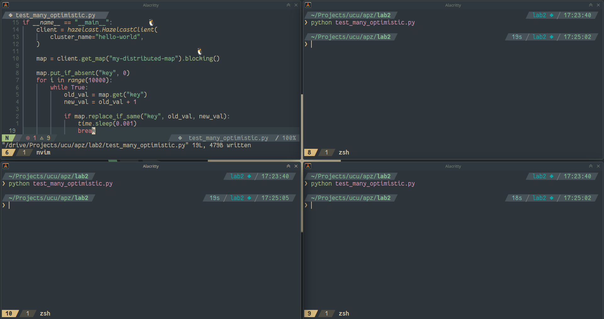

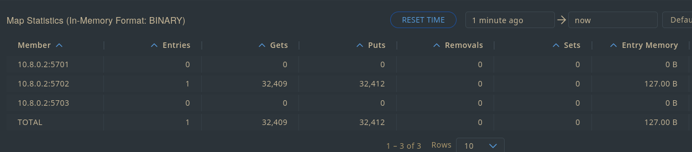

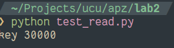

Теж нема data race, аде працює 20 секунд

Зросла кількість запитів - працює схоже до неблокуючих засобів синхронізації, із compare and swap

# 7

Без блокувань є data race, з песимістичним і оптимістичним нема, але оптимістичний набагато швидший

# 8

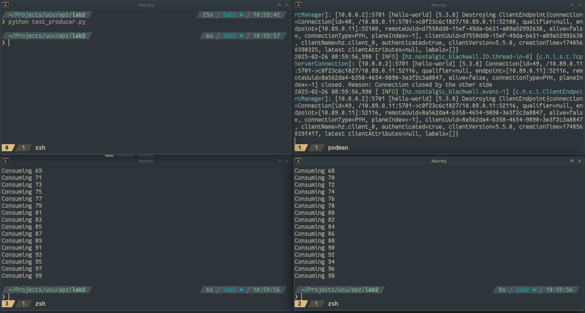

Кожен клієнт, як там встигає, так і забирає з черги елемент - тож виходить, що вони зазвичай чергуються по одному елементу, але деколи один встигає взяти два, поки інший жодного

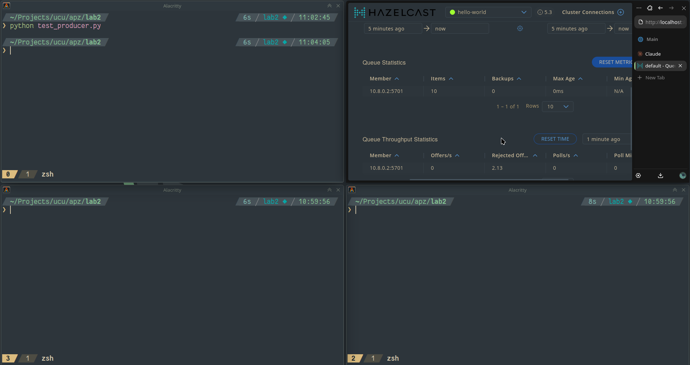

Чомусь якщо немає клієнтів, що забирають із черги, hazelcast не робить, аби запис у чергу блокувався при досягненні границі розміру черги. Тож таке враження, що після 10 записів решта даних починає зникати замість того, аби заблокувати запис (бачимо багато rejected на панелі керування). Напевно, це треба реалізовувати самостійно, якщо робити production ready.
